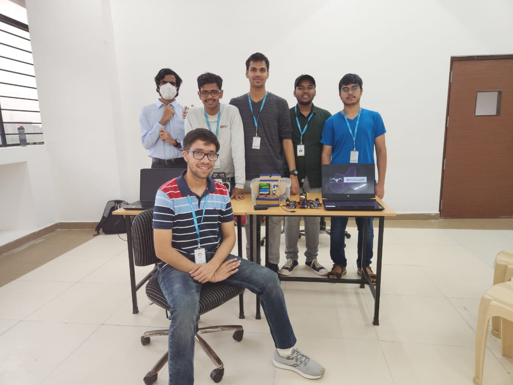

# Real-Time Drone Application

## Project Overview

This project presents a real-time drone application designed to track moving vehicles with high precision and reliability. The system is particularly suited for law enforcement, military operations, and security applications where continuous and accurate tracking of a target vehicle is critical.

## Abstract

The proposed system employs a drone equipped with a sophisticated tracking system that integrates GPS, sensors, and cameras to identify and follow a target vehicle. Once the vehicle is detected, the drone deploys an electromagnet that securely attaches to the vehicle’s metal frame. This electromagnet continuously transmits real-time location data, enabling operators to monitor the vehicle's movements and make informed decisions for subsequent actions.

This innovative application provides an advanced tool for scenarios requiring precise vehicle tracking, offering significant advantages over traditional methods. The system's design prioritizes ease of use and remote operation, making it an ideal solution for time-sensitive situations where quick and decisive action is necessary.

## Key Features

- **Real-time Tracking:** Continuous updates on the vehicle's location and movement.
- **Ease of Use:** Designed for easy deployment and operation, even in high-pressure situations.
- **Remote Operation:** Allows for safe and efficient vehicle tracking from a distance.
- **Versatile Applications:** Suitable for law enforcement, military operations, security, and transportation.

## Documentation
Please refer to [Documentation](src/Docs/ECS.pdf) and [SRS](src/Docs/ECS.pptx) for Documentation

## Team

## Conclusion

The Real-Time Drone Application offers a cutting-edge approach to vehicle tracking, providing enhanced efficiency and security in critical operations. Its combination of advanced technology and practical design makes it a valuable asset for any organization requiring precise and reliable tracking capabilities.
